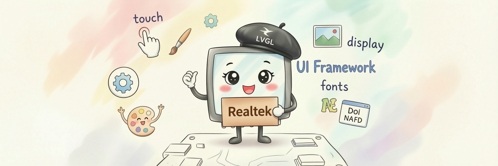

<div align="center">



# ameba-ui

**瑞昱 Ameba 系列芯片官方图形与显示中间件 —— 集成 LVGL、屏驱动、触摸与图像库。**

[](https://lvgl.io)
[](https://github.com/Ameba-AIoT/ameba-ui/search?l=c)
[](https://github.com/Ameba-AIoT/ameba-rtos)
[](https://github.com/Ameba-AIoT/ameba-ui/commits/master)
[](https://gitee.com/ameba-aiot/ameba-ui)

[English](README.md) · [中文版](README_CN.md) · [文档](https://aiot.realmcu.com/zh/latest/rtos/index.html) · [ameba-rtos](https://github.com/Ameba-AIoT/ameba-rtos)

</div>

ameba-ui 是瑞昱官方推出的图形与显示中间件，集成了 LVGL 图形库、带丰富屏驱动的显示抽象层、触摸输入子系统，以及图像/字体库。它作为 [ameba-rtos](https://github.com/Ameba-AIoT/ameba-rtos) 的 `component/ui` submodule 使用。

## 🔌 支持的芯片

| 芯片                   | 接口                 |         master         |      release/v1.2      |
|:---------------------- |:-------------------- |:----------------------:|:----------------------:|
| RTL8721F| RGB | ![alt text][supported] | ![alt text][supported] |
| RTL8730E| MIPI-DSI | ![alt text][supported] | ![alt text][supported] |

[supported]: https://img.shields.io/badge/-%E6%94%AF%E6%8C%81-green "supported"

> LVGL 本身可移植，也能运行在其他 Ameba 芯片上；随附的屏驱动与触摸驱动在 AmebaGreen2 与 AmebaSmart 上验证过。

## ✨ 主要特性

ameba-ui 以 LVGL为核心，并配套现成的 Ameba HAL 移植层，开箱即用。它提供覆盖 MIPI-DSI、RGB、SPI 等接口的统一显示抽象层与面板管理器，内置多款主流屏幕控制器和电容触摸控制器驱动，通过输入管理器统一接入。此外还集成了常用的图像解码（JPEG / PNG / QOI）、FreeType 字体光栅化，以及轻量级嵌入式 Flash 数据库等第三方库，可按需在 menuconfig 中启用。

## 📚 相关文档

最新版文档请访问：[FreeRTOS SDK 及使用指南](https://aiot.realmcu.com/zh/latest/rtos/index.html)。

更多关于 Ameba 系列芯片的信息，请访问[官方产品页面](https://aiot.realmcu.com/zh/product/index.html)。

## 📦 使用方式

ameba-ui 作为 ameba-rtos 的 `component/ui` submodule 使用，不单独编译。

**1. 拉取带 submodule 的 ameba-rtos（XDK）**

```bash
git clone --recurse-submodules https://github.com/Ameba-AIoT/ameba-rtos.git
```

若已克隆 ameba-rtos 但未拉取 submodule：

```bash
git submodule update --init --recursive component/ui
```

**2. 配置 SDK 环境**

```bash
source env.sh   # Linux
env.bat         # Windows
```

**3. 在 Kconfig 中启用 UI**

```bash
ameba.py soc <soc_name>   # 例如：RTL8721F、RTL8730E
ameba.py menuconfig
```

在 `menuconfig` 中进入 **Graphics Libraries Configuration**：

- 启用 **Graphics UI**
- **Panel Selection** — 选择与硬件匹配的屏
- **Touch Controller Selection** — 启用触摸并选择控制器（CST328 / GT911 / TDDI）
- **Third Party Libraries** — 按需启用图像/格式库（libjpeg-turbo、libpng、QOI、zlib）

**4. 编译**

```bash
ameba.py build
```

## 🌐 使用 Gitee 加速

对于可以访问 [Gitee](https://gitee.com) 的用户，当发现从 GitHub 下载过慢时，可使用 Gitee 镜像仓库 [ameba-ui](https://gitee.com/ameba-aiot/ameba-ui) 以提升下载速度。

## 💬 反馈

* 如果你在开发过程中有任何问题或建议，请登录 [Real-AIOT 论坛](https://forum.real-aiot.com/) 给我们反馈。
* 如果你发现了错误或需要新功能，请先[查看 GitHub Issues](https://github.com/Ameba-AIoT/ameba-ui/issues)，确保该问题尚未被提交。
